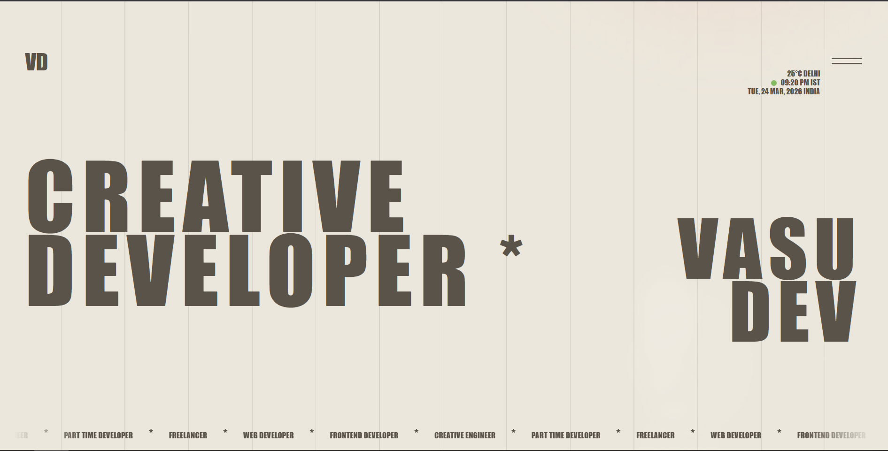

# Vasudev Portfolio

A modern, creative developer portfolio built with React, TypeScript, and Vite.

## Features
- Creative landing page
- Animated transitions
- Responsive design
- Contact form
- Project showcase
- Custom UI components (shimmer button, orbiting circles, etc.)

## Getting Started

### Prerequisites
- Node.js (v16 or higher recommended)
- npm or yarn

### Installation
```bash
npm install
# or
yarn install
```

### Running Locally
```bash
npm run dev
# or
yarn dev
```

The app will be available at `http://localhost:5173` by default.

### Building for Production
```bash
npm run build
# or
yarn build
```

### Preview Production Build
```bash
npm run preview
# or
yarn preview
```

## Folder Structure
- `src/` — Main source code
	- `components/` — UI and page components
	- `app/` — App shell and context
	- `pages/` — Page-level components
	- `assets/` — Static assets (images, models, etc.)
- `public/` — Public static files

## Customization
- Update your information and images in the relevant components and assets folders.
- Modify styles in the `styles/` directory.


© 2026 Vasudev. All rights reserved.
